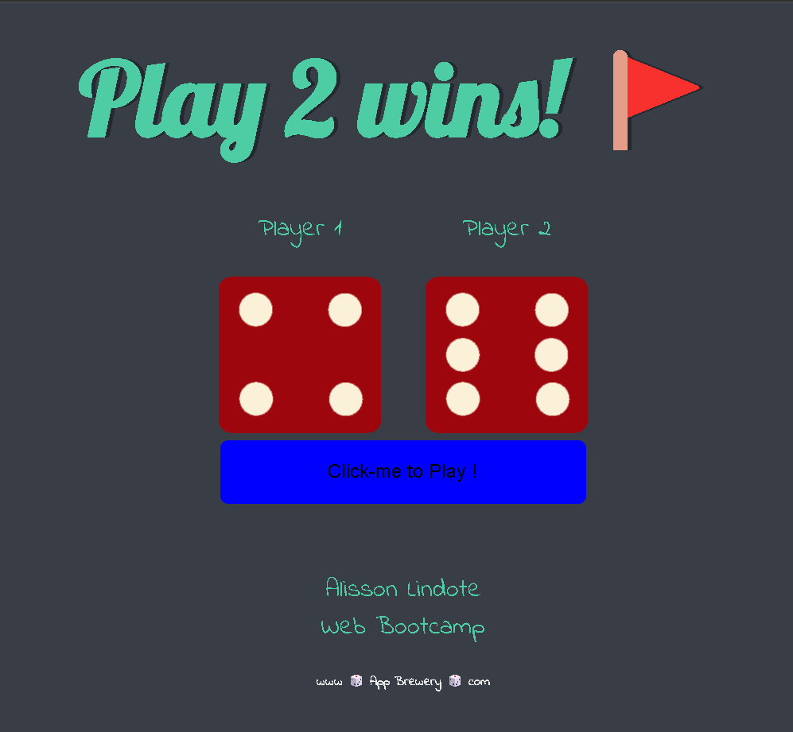

# Decee Challange

- Web page with two diferent dices,
- Dices must change values when the pages reloads
- Title must show wich player wins



# HTML

```HTML
<!DOCTYPE html>
<html lang="en" dir="ltr">
  <head>
    <meta charset="utf-8">
    <title>Dicee</title>
    <meta name="viewport" content="width=device-width, initial-scale=1.0">
    <meta author="Alisson Lindote">
    <meta source="Web development Bootcamp Udemy">
    <link rel="stylesheet" href="styles.css">
    <link href="https://fonts.googleapis.com/css?family=Indie+Flower|Lobster" rel="stylesheet">
  </head>
  <body>

    <div class="container">
      <h1></h1>

      <div class="dice">
        <p>Player 1</p>
        
      </div>

      <div class="dice">
        <p>Player 2</p>
        
      </div>
      <div>
        <button id="abc" onclick="ChangeBG()" class="blue">Click-me to Play ! </button>
      </div>

    </div>

    <script src='index.js'></script>
  </body>

  <footer>
    <p>Alisson Lindote  <br/> Web Bootcamp</p>
   <h4>www 🎲 App Brewery 🎲 com</h4>
  </footer>
</html>


```

# JS

```JS
var randomNumber1 = Math.floor(Math.random() * 6) + 1;
var randomNumber2 = Math.floor(Math.random() * 6) + 1;

var ramdomDiceImage = 'dice' + randomNumber1 + '.png';
var ramdomDiceImage2 = 'dice' + randomNumber2 + '.png';

var ramdomImageSource = './images/' + ramdomDiceImage;
var ramdomImageSource2 = './images/' + ramdomDiceImage2;

var image1 = document.querySelectorAll('img')[0];
var image2 = document.querySelectorAll('img')[1];

image1.setAttribute('src', ramdomImageSource);
image2.setAttribute('src', ramdomImageSource2);

// Who is winning?

if (randomNumber1 > randomNumber2) {
	document.querySelector('h1').innerHTML = '  🚩 Play 1 wins!';
} else if (randomNumber2 > randomNumber1) {
	document.querySelector('h1').innerHTML = ' Play 2 wins! 🚩';
} else {
	document.querySelector('h1').innerHTML = ' Refresh Me!';
}

function ChangeBG() {
	window.location.reload();
}

```
